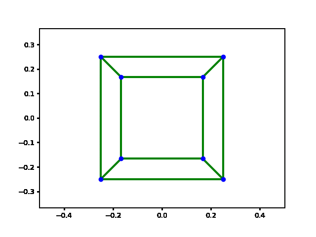
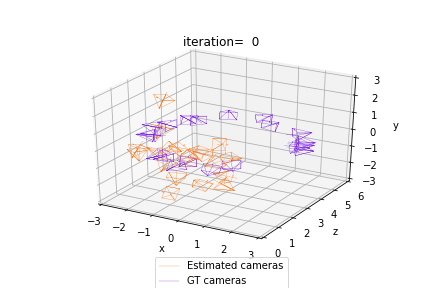

# 3d Transforms [](https://twitter.com/intent/tweet?text=Wow:&url=https%3A%2F%2Fgithub.com%2FRishit-dagli%2F3d-transforms)

[](https://pypi.org/project/tensorflow3dtransforms/)
[](https://github.com/Rishit-dagli/3d-transforms/actions/workflows/python-publish.yml)
[](https://github.com/Rishit-dagli/3d-transforms/actions/workflows/sphinx-ci.yml)

[](LICENSE)
[](https://github.com/psf/black)
[](https://github.com/Rishit-dagli/3d-transforms/stargazers)
[](https://github.com/Rishit-dagli)
[](https://twitter.com/intent/follow?screen_name=rishit_dagli)

TensorFlow3d Transforms is a library to easily make 3D transformations and work with 3D data. This library originally started as a few functions here and there for my own work which I then turned into a library.

TensorFlow3d Transforms is designed to integrate smoothly with deep learning methods for predicting and manipulating 3D data. For this reason, all operators in TensorFlow3d Transforms:

- Are implemented using TensorFlow tensors
- Can handle minibatches of hetereogenous data
- Can be differentiated
- Can utilize GPUs for acceleration

 

This project also draws much inspiration from [PyTorch3D](https://github.com/facebookresearch/pytorch3d).

## Installation

To install the latest release of TensorFlow3d Transforms, run:

```bash
pip install tensorflow3dtransforms
```

## 📄Documentation

[Visit the documentation](https://rishit-dagli.github.io/3d-transforms/) of this project to get more information in detail.

## 📚Examples

[Visit the Quickstart](https://rishit-dagli.github.io/3d-transforms/quick_start) for this project to see some examples and use this library easily.

## 🙋‍♂️Want to Contribute?

Awesome! If you want to contribute to this project, you're always welcome! See [Contributing Guidelines](CONTRIBUTING.md). You can also take a look at [TensorFlow3d Transforms's Project Status Tracker](https://github.com/users/Rishit-dagli/projects/10) for getting more information about current or upcoming tasks.

## License

```
Copyright 2023 Rishit Dagli

Licensed under the Apache License, Version 2.0 (the "License");
you may not use this file except in compliance with the License.
You may obtain a copy of the License at

    http://www.apache.org/licenses/LICENSE-2.0

Unless required by applicable law or agreed to in writing, software
distributed under the License is distributed on an "AS IS" BASIS,
WITHOUT WARRANTIES OR CONDITIONS OF ANY KIND, either express or implied.
See the License for the specific language governing permissions and
limitations under the License.
```